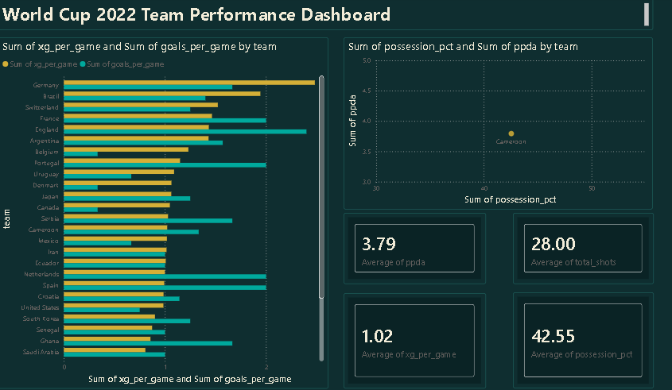

# Team Performance Dashboard

A Power BI dashboard comparing all 32 teams from the 2022 FIFA World Cup on attacking output, chance quality, and playing style.

## What it does
- Pulls all match events (234,000+) from World Cup 2022 using StatsBomb's open data
- Calculates team-level stats: goals per game, xG per game, shots per game, possession %, and PPDA (pressing intensity)
- Compares actual goals against xG to spot over and underperforming teams
- Plots possession vs PPDA to reveal team playing style (control vs counter-attack, high press vs low press)

## Key insight
Germany had the highest xG per game (2.48) in the tournament but were eliminated in the group stage, a clear case where underlying chance quality did not match results.

## Dashboard

## Tech used
Python (pandas, NumPy) for data processing, Power BI for the dashboard, StatsBomb open data (via statsbombpy)

## Data source
[StatsBomb Open Data](https://github.com/statsbomb/open-data)
